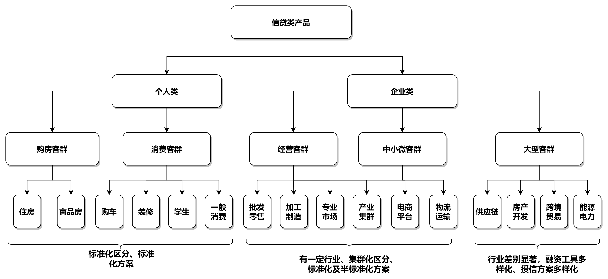
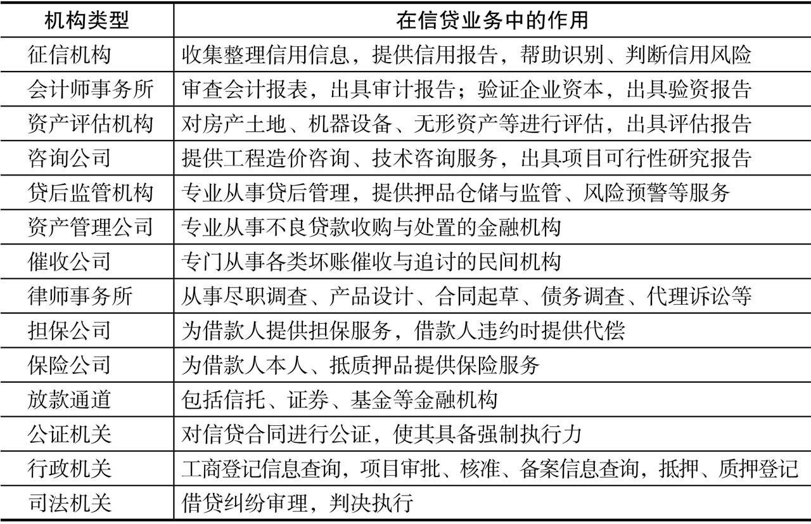

???+note
    本页面将着重介绍信贷类产品，包括什么是信贷、信贷的基础概念、信贷产品分类、信贷产品监管。

## 一、什么是信贷

金融的本质是跨时空的价值交换，是信用、杠杆和风险的总和，是钱生钱的游戏。信贷是金融重要组成部分，是以货币为起点和终点的借贷行为，是企业借债还钱的活动。

信贷中的借债还钱，总是跟信用、杠杆和风险联系在一起，低信用加上高杠杆就一定会发生风险。本章主要简要介绍下信贷产品，为之后的进阶内容做铺垫。

## 二、信贷的基础概念

贷款、借款、信贷、授信、融资，这些词汇经常被混用。贷款是最传统、最广泛的银行信贷业务，银行提供资金、到期收回本息，银行是贷款方，客户是借款人。

### 2.1 信贷的借款方

借款方，即贷款机构借款的客户，根据客群群体的不同，一般可以分为个人类和企业类客户，根据客户的贷款用途、行业可以进一步细分，如下：

### 2.2 信贷的贷款方

贷款方，又称为贷款机构，目前的贷款方包括三大类：

- 一是受银监会监管的传统金融机构，包括银行和非银行金融机构；
- 二是不受银监会监管的放贷机构，如小额贷款公司、民间借贷等；
- 三是一般性的商业信用。后两类一般称为“影子银行”。

### 2.3 其他相关机构

这些机构，可以分为两类：一类是政府部门；另一类是市场化机构。

### 2.4 

对于有信贷需求的人来说最关注的就是额度和利率，额度基本是基于申请人的收入水平来计算，而利率则和用户质量以及机构风控水平息息相关。

### 2.5 利率和还款方式介绍

## 三、信贷产品的分类

## 3.1 信贷产品目标客群定位

## 五、信贷产品的风控

## 参考资料

[^note1]:Credit介绍:  https://wikipedia.org/wiki/Credit
