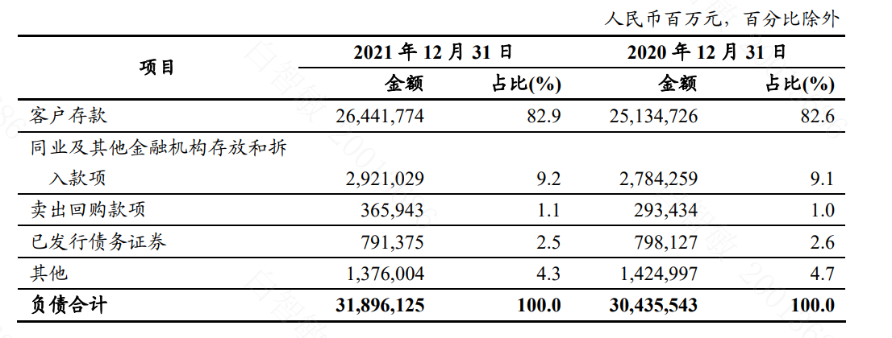
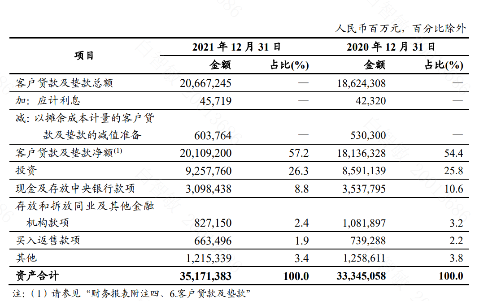

## 银行的资产负债表

要理解银行的运作，首先需要考察银行的**资产负债表**（balance sheet)，即银行的资产和负债的列表。顾名思义，这个表是平衡的，也就是说，它具有以下特征：

$$总资产=总负债+所有者权益$$
银行的资产负债表还是银行的资金来源（负债）和资金投入（资产）的列表：

**1、负债**

银行通过发行负债获取资金，因此负债是银行的资金来源，银行的主要负债包括（以工商银行的财务报表为例[^note1]）：

**2、资产**

银行将发行负债所获取用于购买盈利性资产，银行的主要资产包括（以工商银行的财务报表为例[^note1]）：

**3、所有者权益**

## 参考资料

[^note1]: 中国工商银行2021财务报表：http://v.icbc.com.cn/userfiles/Resources/ICBCLTD/download/2022/1ndbg_A.pdf
[^note2]:工商银行(601398)资产负债表: http://money.finance.sina.com.cn/corp/go.php/vFD_BalanceSheet/stockid/601398/ctrl/part/displaytype/4.phtml