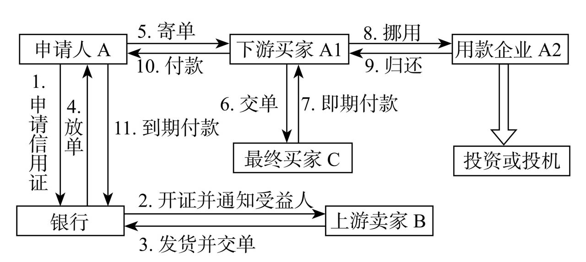

???+note

	本页面介绍信贷的主流产品，包括传统贷款产品、票据融资、贸易融资、供应链金融、消费金融和类信贷业务。

## 一、 传统贷款产品

贷款产品的划分有很多标准，例如按照客户类型划分为法人贷款和自然人贷款；按期限分为短期贷款、中期贷款和长期贷款；按照用途划分为流动资金贷款、固定资产贷款、并购贷款、个人经营性贷款、个人消费贷款等。

### 1.1 流动资金贷款

流动资金贷款是为了满足中短期资金需求，保证生产经营活动正常进行而发放的贷款。银监会《流动资金贷款管理暂行办法》，对其进行了详细规定。

流动资金贷款深受企业欢迎，原因就是在所有贷款中，流动资金贷款是资金监管最松、用途最宽泛的，相当于拿到一笔现金，自由支配。

流动资金贷款通常适用于信用良好的大企业，逻辑就是，信任这些企业不会乱花钱；通常还要求借款人提供强有力的担保，例如房产抵押，逻辑就是，既然无法把握第一还款来源，那就依赖第二还款来源。

### 1.2 固定资产贷款

固定资产贷款，顾名思义，是用于借款人固定资产投资的贷款，主要用于固定资产项目的建设、购置、改造及其相应配套设施建设。

通常来说，固定资产贷款风险也是比较大的，由于固定资产投资往往会改变企业的运营模式。我们能考察的是历史表现，然而历史表现能否推及未来？未来是难以预测的。

## 二、 票据融资

票据融资和贸易融资可以理解为传统流动资金贷款的改进产品，限定了贷款的用途（一笔交易），强调交易背景、场景，进而控制风险。

票据包括本票、支票、汇票，都是结算工具。汇票按出票人的不同分为银行汇票和商业汇票，而商业汇票具有融资功能。商业汇票还有承兑人，承兑人是银行的就是银行承兑汇票（简称“银票”），承兑人是工商企业的就是商业承兑汇票（简称“商票”）。

### 2.1 商业承兑汇票

商业承兑汇票，简单来说，就是企业之间的欠条，属于商业信用。

和欠条不同，有了《票据法》的保障，商业承兑汇票就可以流通、转让，最终票据持有人不一定是票据上载明的收款人，票据到期了，持有人可以向承兑人与付款人中间的任意一个请求付款，一般是通过银行进行托收。

### 2.2 银行承兑汇票

银行承兑汇票，全称是商业汇票银行承兑业务。由于银行承诺到期兑付商业汇票，就和现金一样，几乎是零风险。

一般来说，企业自身信用非常好，交易对手能够接受，完全可以签发商票，这样成本最低，如汽车厂商通常签发商业承兑汇票；如果要签发银票，借助银行信用，银行承担了出票人（承兑申请人）的信用风险，那么出票人就要给银行支付对价，在目前的定价条件下，这种对价往往体现为缴纳一定比例的保证金存款，所以银票是拉存款的好工具。

## 三、 贸易融资

贸易融资最早源于国际业务，因其紧扣交易环节，风险控制效果较好，后来陆陆续续在国内贸易中得到运用。近年来，大家说的贸易融资产品大多数都是国内信贷业务，而且贸易融资大有取代传统流动资金贷款的趋势。

贸易融资的模式主要包括：信用证、货押融资、保理等。

### 3.1 信用证

信用证，是开证银行依照申请人（购货方）的要求向受益人（销货方）开出的载有一定金额的，在一定期限内凭信用证规定的单据支付款项的书面承诺。

### 3.2 货押融资

贸易融资风险控制的重要抓手就是货物，一笔贷款对应一批货物。货押是指借款人将自有的货物（包括外购商品、库存原材料、库存产品等）或货权质押给银行，银行通过对质押物实施占有或监管而给予资金或信用支持的授信业务。

货押融资形式多样，以保兑仓为例：保兑仓是标准化的货押产品，需要厂家配合，实务中难以实现，主要依靠对货物的直接监管。对于货押，最重要的是货物的监测与控制，实务中有一系列的监测指标：存货的吞吐量、存货周转率、流动比率、警戒线等。

### 3.3 保理

保理是指销售商（债权人）将其与买方（债务人）订立的货物销售（服务）合同所产生的应收账款转让给银行，由银行为其提供融资。

保理与应收账款质押很相似，但是有区别。应收账款质押贷款是指企业将应收账款收款权作为还款担保的一种贷款，其第一还款来源还是卖方（融资方），不是买方。保理业务实现了应收账款的真实转让，买方是第一还款来源。所以说，应收账款质押贷款是卖方信用，而保理是买方信用。

### 3.4 总结

贸易融资做得好不好，关键是对交易过程控制得如何。但是金融机构有什么样的条件去监测和控制交易过程呢？传统上，由于银行不是产业资本，没有深度介入产业链条，难以控制贷款用途、还款来源，退而求其次，银行只能依靠担保抵押，选择信用度高的借款人做流动资金贷款。重要的不是产品的外在形式和名称，而在于找到适合本金融机构的风险控制模式，没有良好的风险控制抓手，贸易融资就会成为高风险产品。

## 四、供应链金融

贸易融资是为满足企业在贸易链条上不同节点的融资需求所提供的授信支持；供应链金融则更进一步，是对供应链上单个企业或上下游多个企业提供的全面金融服务的一种业务模式。

任何单一的贸易融资产品都难以形成资金闭环，银行只有将整个供应链纳入自己的服务体系，甚至建立自己独立的交易平台、支付结算体系，才能控制风险。类似于“上帝视角”，当你知道所有对手的筹码，就不会有信用风险，剩下的就是操作风险。

供应链金融成功的关键因素是整合供应链条上的资金流、物流和信息流等核心数据，从而把单个企业不可控的风险转化为供应链整体可控的风险，从而更有效地控制风险。

谁来做这种整合工作？资金、物流、信息常常处于分割状态，各方都想主导。根据主导方的不同，从而有不同的模式。

### 4.1 银行模式

最典型的就是银行的“1+N”模式。“1”代表核心企业，“N”代表上下游企业。

一般供应链中均存在一个优质的核心企业，例如汽车行业中的厂家、煤炭行业的煤矿开采企业、房地产行业中的开发商、钢铁行业中的钢厂。核心企业实力较强，谈判地位较高，银行难以通过传统贷款获得较高收益。

银行营销的重点就是对核心企业提供授信以及账户管理、投行业务等高附加值产品，通过核心企业对上下游客户群的控制力，打开上下游渠道，让上下游启用授信。上游主要是供应商，核心企业希望上游供应要稳定，就需要解决供应商资金短缺的问题；下游企业主要是销售商，核心企业需要建立强大的销售网络，扩大市场份额，这就需要下游销售商有较强的资金实力，这些就为银行介入提供了机会。

实务中，银行先找到行业内的核心企业，签订合作协议，核心企业提供信息流，银行通过信息流设计产品。

银行模式的风险在于，无论客户是上游还是下游，银行所承担的信用风险最终来自核心企业，上游应收账款来自核心企业，对下游的担保也是核心企业。这种模式表面上是服务了上下游，实质上还是核心企业在用信，与一笔大额贷款放给核心企业，核心企业转贷给上下游没有太大区别。

银行模式需要核心企业、第三方监管、保险等多方参与合作，环节多、漏洞也就多，交易成本比较高。

### 4.2 产融结合模式

常见的有企业集团财务公司以及厂商系的汽车金融公司、消费金融公司、融资租赁公司。很多银行都会给核心企业授信，核心企业资金成本非常低，核心企业也掌握了供应链数据，完全可以自己做供应链融资，剩下就是申请金融牌照、开发融资产品。

金融结合产业，有了“场景”，营销与风控都有了抓手，从流贷贸易融资化，供应链、产业链金融以及互联网、物联网金融的兴起就可以看出来，金融与产业越来越密切。

产融结合模式的缺点是风险集中于同一行业，甚至同一企业，信贷客户的风险同质化。和银行不同，产融结合的信贷决策要服务于产业目标，对风险的考虑不够独立。

### 4.3 第三方模式

一些技术企业有意识地开发供应链软件，虚拟物流软件，通过收集数据，掌握供应链上下游企业的盈利状况和资金运动规律，在一些基金的支持下，也能在软件上嫁接一些金融产品。

难点就是如何低成本拿到真实数据。这些虚拟物流软件看似免费做物流服务，实际上就是在为风险控制模型采集数据，让企业自觉自愿地贡献数据，数据积累到一定程度就成了金矿，最后通过金融服务变现。

## 五、 消费金融

### 5.1 联合贷模式

### 5.2 

## 六、 类信贷